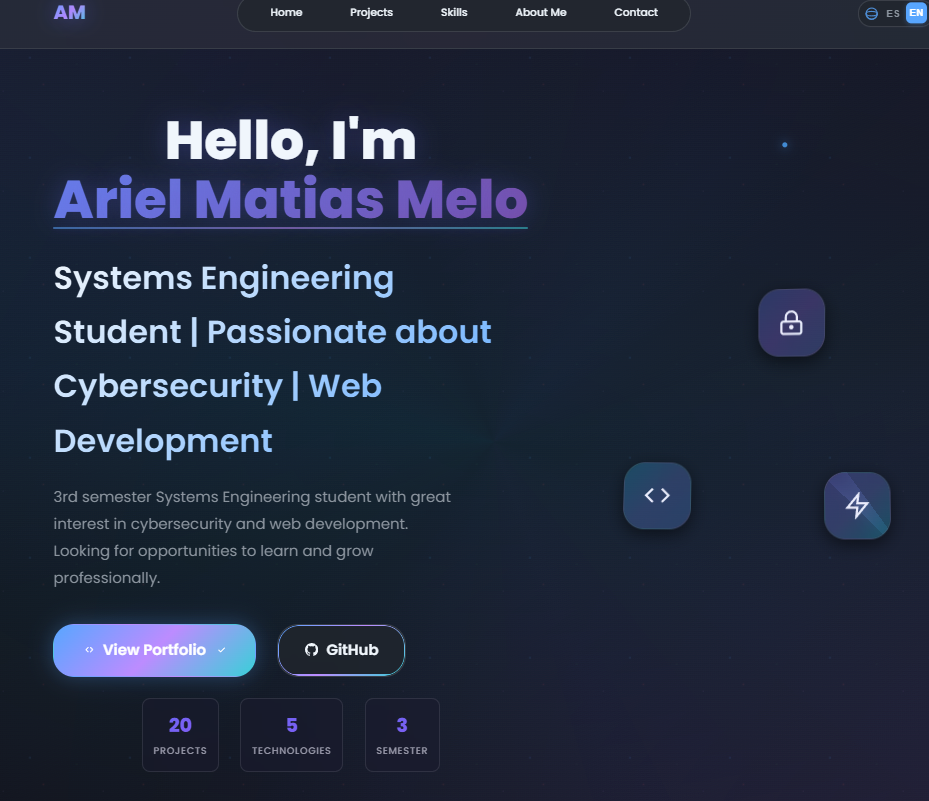
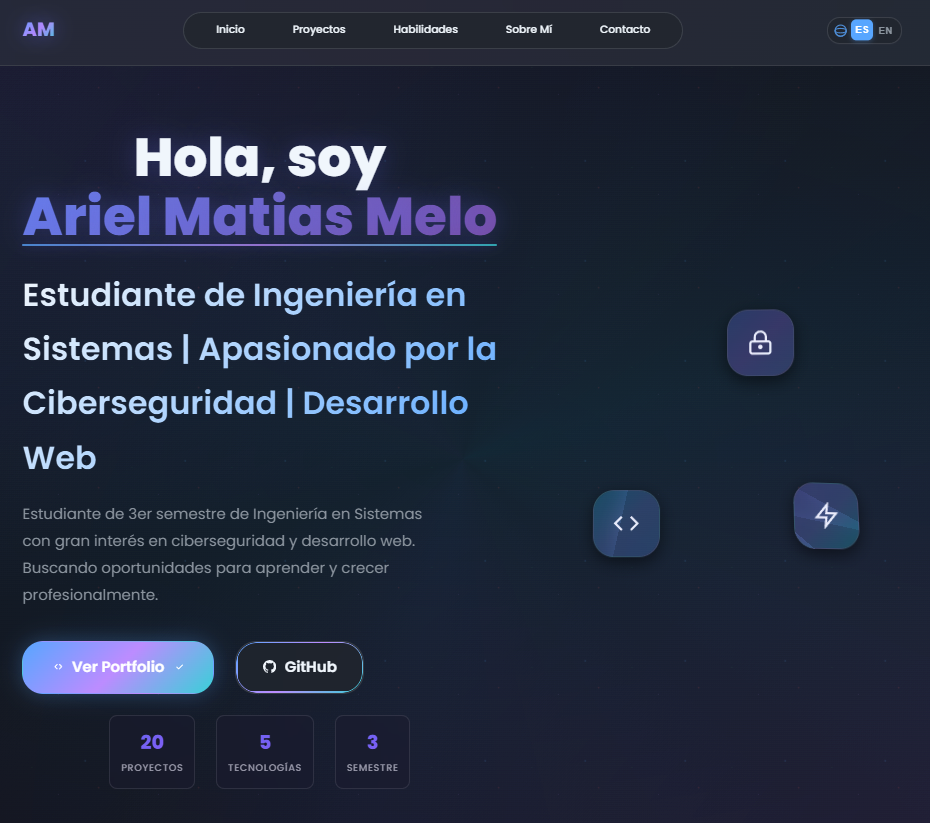
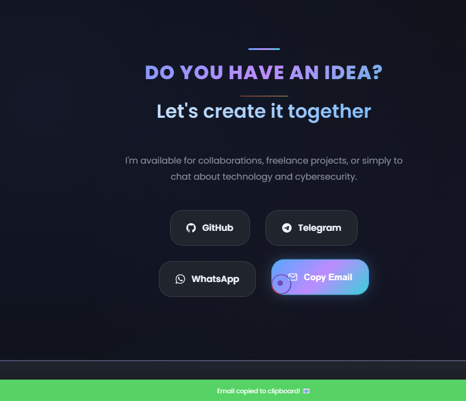

# 💼 Portafolio Moderno Dev

<div align="center">



[](https://portafolio-moderno-dev.vercel.app)
[](https://developer.mozilla.org/en-US/docs/Web/HTML)
[](https://developer.mozilla.org/en-US/docs/Web/CSS)
[](https://developer.mozilla.org/en-US/docs/Web/JavaScript)
[](https://developer.mozilla.org/en-US/docs/Learn/CSS/CSS_layout/Responsive_Design)

[](https://github.com/mat1520/Portafolio-Moderno-Dev/stargazers)
[](https://github.com/mat1520/Portafolio-Moderno-Dev/network/members)
[](https://github.com/mat1520/Portafolio-Moderno-Dev/watchers)

**🚀 Portafolio personal moderno y responsivo para desarrollador web**

[Ver Demo](https://mat1520.github.io/Portafolio-Moderno-Dev) • [Reportar Bug](https://github.com/mat1520/Portafolio-Moderno-Dev/issues) • [Solicitar Característica](https://github.com/mat1520/Portafolio-Moderno-Dev/issues)

</div>

---

## 📖 Descripción

Portafolio profesional de **Ariel Matias Melo** - Estudiante de Ingeniería en Sistemas especializado en ciberseguridad y desarrollo web full-stack. Diseñado con las últimas tecnologías y mejores prácticas de desarrollo frontend, presentando una interfaz moderna, elegante y completamente responsiva.

### 🖼️ Capturas de Pantalla

<div align="center">

| Inicio | Sobre Mí | Proyectos |
|--------|----------|-----------|
|  |  |  |

</div>

## ✨ Características

- 📁 **Diseño Moderno**: Interfaz elegante con gradientes y efectos glassmorphism
- 📱 **Completamente Responsivo**: Optimizado para todos los dispositivos
- 🎨 **Animaciones Suaves**: Transiciones fluidas y efectos visuales atractivos
- 🌐 **Multiidioma**: Soporte para Español e Inglés
- ⚡ **Rendimiento Optimizado**: Carga rápida y experiencia fluida
- 🔧 **Fácil Personalización**: Código limpio y bien documentado
- 🎯 **SEO Optimizado**: Meta tags y estructura semántica
- 💫 **Cursor Personalizado**: Efectos interactivos únicos
- 📧 **Formulario de Contacto**: Integración con múltiples plataformas

## 🛠️ Tecnologías Utilizadas

<div align="center">

| Frontend | Herramientas | Características |
|----------|--------------|----------------|
|  |  |  |
|  |  |  |
|  |  |  |

</div>

### 🎨 Técnicas Avanzadas

- **CSS Grid & Flexbox** para layouts modernos
- **CSS Custom Properties** para theming dinámico
- **Intersection Observer API** para animaciones on-scroll
- **i18next** para internacionalización
- **Glass Morphism** y efectos visuales modernos

## 📁 Estructura del Proyecto

```
Portafolio-Moderno-Dev/
├── 📁 assets/
│   ├── 📁 css/
│   │   └── 🎨 style.css          # Estilos principales
│   └── 📁 js/
│       └── ⚡ script.js          # Funcionalidad JavaScript
├── 🖼️ Bienvenido.png            # Imagen de bienvenida
├── 🖼️ SobreMi.png               # Imagen de presentación
├── 🖼️ Welcome.png               # Banner principal
├── 🖼️ Notification_Email.png    # Imagen de notificación
├── 🌐 index.html                # Página principal
├── 📄 LICENSE                   # Licencia del proyecto
└── 📋 README.md                 # Este archivo
```

## 🚀 Instalación y Uso

### Requisitos Previos

- Navegador web moderno (Chrome, Firefox, Safari, Edge)
- Servidor local opcional (Live Server, XAMPP, etc.)

### Instalación

1. **Clona el repositorio**
   ```bash
   git clone https://github.com/mat1520/Portafolio-Moderno-Dev.git
   ```

2. **Navega al directorio**
   ```bash
   cd Portafolio-Moderno-Dev
   ```

3. **Abre en el navegador**
   ```bash
   # Opción 1: Abrir directamente
   open index.html
   
   # Opción 2: Con servidor local
   python -m http.server 8000
   # o usar Live Server en VS Code
   ```

### 🔧 Personalización

1. **Información Personal**: Edita las variables en `index.html`
2. **Estilos**: Modifica las CSS Custom Properties en `assets/css/style.css`
3. **Traducciones**: Actualiza los objetos de traducción en `assets/js/script.js`
4. **Proyectos**: Añade tus proyectos en la sección correspondiente

## 🌟 Proyectos Destacados

El portafolio incluye algunos de mis proyectos más relevantes:

- 💳 **[Credit Card Generator Luhn](https://github.com/mat1520/Credit-Card-Gen-Luhn)** - Generador de tarjetas con algoritmo Luhn
- 🏦 **[Buró de Crédito EC](https://github.com/mat1520/BURO-DE-CREDITO-EC)** - Sistema de consulta crediticia
- 📄 **[API Facturación Electrónica](https://github.com/mat1520/api-facturacion-electronica-ecuador)** - API para facturación electrónica
- 🎓 **[Yachay App](https://github.com/mat1520/yachay-app)** - Aplicación educativa
- 🌟 **[Star Wars Character Detector](https://github.com/mat1520/Star-Wars-Character-Detector)** - Detector de personajes
- Modifica los estilos en `style.css` o en `assets/css/`
- Añade funcionalidades en `script.js` o en `assets/js/`
- Reemplaza las imágenes en `assets/images/`

## Contribución
1. Fork el proyecto
### 🔧 Personalización

1. **Información Personal**: Edita las variables en `index.html`
2. **Estilos**: Modifica las CSS Custom Properties en `assets/css/style.css`
3. **Traducciones**: Actualiza los objetos de traducción en `assets/js/script.js`
4. **Proyectos**: Añade tus proyectos en la sección correspondiente
- Personaliza los estilos y colores según tu marca personal

## 📊 Métricas del Proyecto

<div align="center">


</div>

## 📱 Compatibilidad

| Navegador | Versión Mínima | Estado |
|-----------|----------------|--------|
| Chrome | 90+ | ✅ Totalmente Compatible |
| Firefox | 88+ | ✅ Totalmente Compatible |
| Safari | 14+ | ✅ Totalmente Compatible |
| Edge | 90+ | ✅ Totalmente Compatible |
| Opera | 76+ | ✅ Totalmente Compatible |

## 🔗 Enlaces Importantes

- 🌐 **Portfolio en Vivo**: [mat1520.github.io/Portafolio-Moderno-Dev](https://mat1520.github.io/Portafolio-Moderno-Dev)
- 📝 **Mi Blog**: [Próximamente]
- 🎓 **LinkedIn**: [Próximamente]
- 📧 **Email**: arielmelo1520@hotmail.com

## 📞 Contacto

<div align="center">

¿Tienes una idea? **¡Creémosla juntos!**

[](https://github.com/mat1520)
[](https://t.me/MAT3810)
[](https://api.whatsapp.com/send?phone=593984403461&text=Hola%2C%20Ariel%20me%20gusto%20tu%20perfil%20de%20github%20tengo%20una%20duda%20o%20aporte%20hacia%20ti)
[](mailto:arielmelo1520@hotmail.com)

</div>

### 💬 Estoy disponible para:

- 🤝 **Colaboraciones** en proyectos interesantes
- 💼 **Trabajos Freelance** de desarrollo web
- 🔒 **Consultoría** en ciberseguridad
- 📚 **Charlas** sobre tecnología y desarrollo

## 💝 Apoyo al Proyecto

Si este proyecto te ha sido útil, considera darle una ⭐ en GitHub y compartirlo con otros desarrolladores.

### 🎁 Donaciones

Si quieres apoyar mi trabajo y desarrollo de más proyectos como este:

<div align="center">

[](mailto:arielmelo1520@hotmail.com?subject=Donación%20PayPal)
[](mailto:arielmelo1520@hotmail.com?subject=Buy%20Me%20A%20Coffee)

**Bitcoin (BTC)**: `Próximamente`  
**Ethereum (ETH)**: `Próximamente`  

*Cualquier cantidad es muy apreciada y me ayuda a seguir creando contenido de calidad* 💚

</div>

## 🤝 Contribuciones

Las contribuciones son siempre bienvenidas. Si quieres contribuir:

1. **Fork** el proyecto
2. Crea una **branch** para tu feature (`git checkout -b feature/AmazingFeature`)
3. **Commit** tus cambios (`git commit -m 'Add some AmazingFeature'`)
4. **Push** a la branch (`git push origin feature/AmazingFeature`)
5. Abre un **Pull Request**

### 📋 Roadmap

- [ ] 🌙 Modo oscuro/claro toggle
- [ ] 🎨 Más temas de color
- [ ] 📊 Integración con analytics
- [ ] 🔍 Funcionalidad de búsqueda
- [ ] 📝 Blog integrado
- [ ] 🏆 Sección de certificaciones
- [ ] 📱 App móvil PWA completa

## 📄 Licencia

Este proyecto está bajo la Licencia MIT - ve el archivo [LICENSE](LICENSE) para más detalles.

```
MIT License

Copyright (c) 2025 Ariel Matias Melo

Permission is hereby granted, free of charge, to any person obtaining a copy
of this software and associated documentation files (the "Software"), to deal
in the Software without restriction, including without limitation the rights
to use, copy, modify, merge, publish, distribute, sublicense, and/or sell
copies of the Software, and to permit persons to whom the Software is
furnished to do so, subject to the following conditions:

The above copyright notice and this permission notice shall be included in all
copies or substantial portions of the Software.
```

## 🙏 Agradecimientos

- 🎨 **Inspiración de diseño**: Dribbble, Behance y GitHub
- 🖼️ **Imágenes**: Unsplash y iconografía personalizada
- 💻 **Fuentes**: Google Fonts (Poppins)
- 🛠️ **Herramientas**: VS Code, GitHub, Figma

## 📈 Estadísticas del Repositorio

<div align="center">


</div>

---

<div align="center">

**[⬆ Volver al inicio](#-portafolio-moderno-dev)**

Hecho con 💚 y mucho café ☕ por [Ariel Matias Melo](https://github.com/mat1520)

*"El código es poesía, y cada función una estrofa en el gran poema de la tecnología."*

</div>
