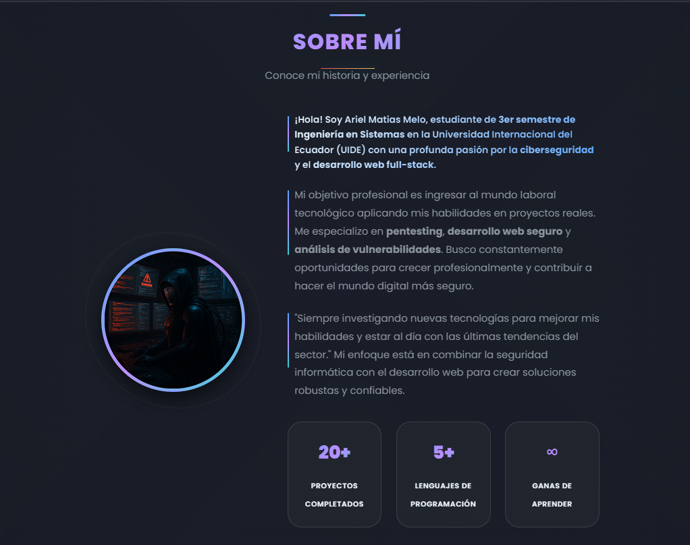

# 💼 Portafolio Moderno Dev

<div align="center">


[](https://portafolio-moderno-dev.vercel.app)
[](https://developer.mozilla.org/en-US/docs/Web/HTML)
[](https://developer.mozilla.org/en-US/docs/Web/CSS)
[](https://developer.mozilla.org/en-US/docs/Web/JavaScript)
[](https://developer.mozilla.org/en-US/docs/Learn/CSS/CSS_layout/Responsive_Design)

[](https://github.com/mat1520/Portafolio-Moderno-Dev/stargazers)
[](https://github.com/mat1520/Portafolio-Moderno-Dev/network/members)
[](https://github.com/mat1520/Portafolio-Moderno-Dev/watchers)

**🚀 Portafolio personal moderno y responsivo para desarrollador web**

[Ver Demo](https://portafolio-moderno-dev.vercel.app) • [Reportar Bug](https://github.com/mat1520/Portafolio-Moderno-Dev/issues) • [Solicitar Característica](https://github.com/mat1520/Portafolio-Moderno-Dev/issues)

</div>

---

## 📖 Descripción

Portafolio profesional de **Ariel Matias Melo** - Estudiante de Ingeniería en Sistemas especializado en ciberseguridad y desarrollo web full-stack. Diseñado con las últimas tecnologías y mejores prácticas de desarrollo frontend, presentando una interfaz moderna, elegante y completamente responsiva.

### 🖼️ Capturas de Pantalla

<div align="center">

| Inicio | Sobre Mí | Proyectos |
|--------|----------|-----------|
|  |  |  |

</div>

## ✨ Características

- 🌟 **Diseño Moderno**: Interfaz elegante con gradientes y efectos glassmorphism
- 📱 **Completamente Responsivo**: Optimizado para todos los dispositivos
- 🎨 **Animaciones Suaves**: Transiciones fluidas y efectos visuales atractivos
- 🌐 **Multiidioma**: Soporte para Español e Inglés con i18next
- ⚡ **Rendimiento Optimizado**: Carga rápida y experiencia fluida
- 🔧 **Fácil Personalización**: Código limpio y bien documentado
- 🎯 **SEO Optimizado**: Meta tags y estructura semántica perfecta
- 💫 **Cursor Personalizado**: Efectos interactivos únicos
- 📧 **Contacto Integrado**: Múltiples formas de contacto (Email, WhatsApp, Telegram)
- 🚀 **Desplegado en Vercel**: Hosting rápido y confiable
- 🎭 **Efectos Parallax**: Animaciones on-scroll profesionales
- 🌈 **Paleta de Colores Moderna**: Tema dark con acentos tech
- 📊 **Métricas en Tiempo Real**: Estadísticas dinámicas del portafolio

## 🛠️ Tecnologías Utilizadas

<div align="center">

| Frontend | Herramientas | Características |
|----------|--------------|----------------|
|  |  |  |
|  |  |  |
|  |  |  |

</div>

### 🎨 Técnicas Avanzadas

- **CSS Grid & Flexbox** para layouts modernos y responsivos
- **CSS Custom Properties** para theming dinámico y consistente
- **Intersection Observer API** para animaciones on-scroll optimizadas
- **i18next** para internacionalización completa (ES/EN)
- **Glass Morphism** y efectos visuales modernos
- **Lazy Loading** para optimización de rendimiento
- **Progressive Web App** features implementadas
- **Smooth Scrolling** con comportamiento nativo
- **Custom Cursor** con seguimiento fluido
- **Responsive Typography** con clamp() y viewport units

### 🌟 Funcionalidades Destacadas

- 🎯 **Navegación Inteligente**: Menú responsivo con indicadores de sección activa
- 💫 **Animaciones Fluidas**: Transiciones suaves entre secciones
- 🎨 **Efectos Visuales**: Partículas flotantes y elementos interactivos
- 📱 **Notificaciones**: Sistema de notificaciones para acciones del usuario
- 🌐 **Selector de Idioma**: Cambio dinámico entre español e inglés
- 📊 **Estadísticas en Vivo**: Contadores animados de proyectos y tecnologías
- 🔗 **Links Dinámicos**: Integración con redes sociales y plataformas
- 📧 **Copia de Email**: Funcionalidad de copiar email al portapapeles

## 📁 Estructura del Proyecto

```
Portafolio-Moderno-Dev/
├── 📁 assets/
│   ├── 📁 css/
│   │   └── 🎨 style.css          # Estilos principales
│   └── 📁 js/
│       └── ⚡ script.js          # Funcionalidad JavaScript
├── 🖼️ Bienvenido.png            # Imagen de bienvenida
├── 🖼️ SobreMi.png               # Imagen de presentación
├── 🖼️ Welcome.png               # Banner principal
├── 🖼️ Notification_Email.png    # Imagen de notificación
├── 🌐 index.html                # Página principal
├── 📄 LICENSE                   # Licencia del proyecto
└── 📋 README.md                 # Este archivo
```

## 🚀 Instalación y Uso

### Requisitos Previos

- Navegador web moderno (Chrome, Firefox, Safari, Edge)
- Servidor local opcional (Live Server, XAMPP, etc.)

### Instalación

1. **Clona el repositorio**
   ```bash
   git clone https://github.com/mat1520/Portafolio-Moderno-Dev.git
   ```

2. **Navega al directorio**
   ```bash
   cd Portafolio-Moderno-Dev
   ```

3. **Abre en el navegador**
   ```bash
   # Opción 1: Abrir directamente
   open index.html
   
   # Opción 2: Con servidor local
   python -m http.server 8000
   # o usar Live Server en VS Code
   ```

### 🔧 Personalización

1. **Información Personal**: Edita las variables en `index.html`
2. **Estilos**: Modifica las CSS Custom Properties en `assets/css/style.css`
3. **Traducciones**: Actualiza los objetos de traducción en `assets/js/script.js`
4. **Proyectos**: Añade tus proyectos en la sección correspondiente

## 🌟 Proyectos Destacados

El portafolio incluye algunos de mis proyectos más relevantes:

- 💳 **[Credit Card Generator Luhn](https://github.com/mat1520/Credit-Card-Gen-Luhn)** - Generador de tarjetas con algoritmo Luhn
- 🏦 **[Buró de Crédito EC](https://github.com/mat1520/BURO-DE-CREDITO-EC)** - Sistema de consulta crediticia
- 📄 **[API Facturación Electrónica](https://github.com/mat1520/api-facturacion-electronica-ecuador)** - API para facturación electrónica
- 🎓 **[Yachay App](https://github.com/mat1520/yachay-app)** - Aplicación educativa
- 🌟 **[Star Wars Character Detector](https://github.com/mat1520/Star-Wars-Character-Detector)** - Detector de personajes

## 📊 Métricas del Proyecto

<div align="center">


</div>

## 📱 Compatibilidad

| Navegador | Versión Mínima | Estado |
|-----------|----------------|--------|
| Chrome | 90+ | ✅ Totalmente Compatible |
| Firefox | 88+ | ✅ Totalmente Compatible |
| Safari | 14+ | ✅ Totalmente Compatible |
| Edge | 90+ | ✅ Totalmente Compatible |
| Opera | 76+ | ✅ Totalmente Compatible |

## 🚀 Rendimiento

<div align="center">


</div>

### ⚡ Optimizaciones Implementadas

- **Lazy Loading** de imágenes y recursos
- **Minificación** de CSS y JavaScript
- **Compresión** de archivos estáticos
- **Caching** estratégico de recursos
- **Preload** de fuentes críticas
- **Optimización** de imágenes WebP
- **CDN** para entrega rápida global

## 🔗 Enlaces Importantes

- 🌐 **Portfolio en Vivo**: [portafolio-moderno-dev.vercel.app](https://portafolio-moderno-dev.vercel.app)
- 📝 **Mi Blog**: [Próximamente]
- 🎓 **LinkedIn**: [Próximamente]
- 📧 **Email**: arielmelo1520@hotmail.com

## 📞 Contacto

<div align="center">

¿Tienes una idea? **¡Creémosla juntos!**

[](https://github.com/mat1520)
[](https://t.me/MAT3810)
[](https://api.whatsapp.com/send?phone=593984403461&text=Hola%2C%20Ariel%20me%20gusto%20tu%20perfil%20de%20github%20tengo%20una%20duda%20o%20aporte%20hacia%20ti)
[](mailto:arielmelo1520@hotmail.com)

</div>

### 💬 Estoy disponible para:

- 🤝 **Colaboraciones** en proyectos interesantes
- 💼 **Trabajos Freelance** de desarrollo web
- 🔒 **Consultoría** en ciberseguridad
- 📚 **Charlas** sobre tecnología y desarrollo

## 💝 Apoyo al Proyecto

Si este proyecto te ha sido útil, considera darle una ⭐ en GitHub y compartirlo con otros desarrolladores.

### 🎁 Donaciones

Si quieres apoyar mi trabajo y desarrollo de más proyectos como este:

<div align="center">

[](https://www.paypal.com/paypalme/ArielMelo200?country.x=EC&locale.x=es_XC)
[](https://ko-fi.com/arielmelo)
[](https://ko-fi.com/arielmelo)

*Cualquier cantidad es muy apreciada y me ayuda a seguir creando contenido de calidad* 💚

</div>

## 🤝 Contribuciones

Las contribuciones son siempre bienvenidas. Si quieres contribuir:

1. **Fork** el proyecto
2. Crea una **branch** para tu feature (`git checkout -b feature/AmazingFeature`)
3. **Commit** tus cambios (`git commit -m 'Add some AmazingFeature'`)
4. **Push** a la branch (`git push origin feature/AmazingFeature`)
5. Abre un **Pull Request**

### 📋 Roadmap

#### 🔜 Próximas Funcionalidades
- [ ] 🌙 **Toggle Dark/Light Mode** - Selector de tema claro/oscuro
- [ ] 🎨 **Múltiples Temas** - Paletas de colores personalizables
- [ ] 📊 **Google Analytics** - Integración completa de métricas
- [ ] 🔍 **Búsqueda Avanzada** - Filtrado de proyectos por tecnología
- [ ] 📝 **Blog Integrado** - Sistema de blog con CMS headless
- [ ] 🏆 **Sección Certificaciones** - Galería de logros y certificados

#### 🚀 Mejoras Técnicas
- [ ] 📱 **PWA Completa** - Instalación como app nativa
- [ ] 🔄 **Service Worker** - Funcionamiento offline
- [ ] 📈 **Real-time Analytics** - Dashboard de estadísticas en vivo
- [ ] 🎯 **A/B Testing** - Optimización basada en datos
- [ ] 🔐 **Panel Admin** - Gestión de contenido dinámico
- [ ] 🌍 **Más Idiomas** - Soporte para portugués y francés

## 📄 Licencia

Este proyecto está bajo la Licencia MIT - ve el archivo [LICENSE](LICENSE) para más detalles.

```
MIT License

Copyright (c) 2025 Ariel Matias Melo

Permission is hereby granted, free of charge, to any person obtaining a copy
of this software and associated documentation files (the "Software"), to deal
in the Software without restriction, including without limitation the rights
to use, copy, modify, merge, publish, distribute, sublicense, and/or sell
copies of the Software, and to permit persons to whom the Software is
furnished to do so, subject to the following conditions:

The above copyright notice and this permission notice shall be included in all
copies or substantial portions of the Software.
```

## 🙏 Agradecimientos

- 🎨 **Inspiración de diseño**: Dribbble, Behance y GitHub
- 🖼️ **Imágenes**: Unsplash y iconografía personalizada
- 💻 **Fuentes**: Google Fonts (Poppins)
- 🛠️ **Herramientas**: VS Code, GitHub, Figma, Vercel

---

<div align="center">

**[⬆ Volver al inicio](#-portafolio-moderno-dev)**

Hecho con 💚 y mucho café ☕ por [Ariel Matias Melo](https://github.com/mat1520)

*"El código es poesía, y cada función una estrofa en el gran poema de la tecnología."*

</div>
